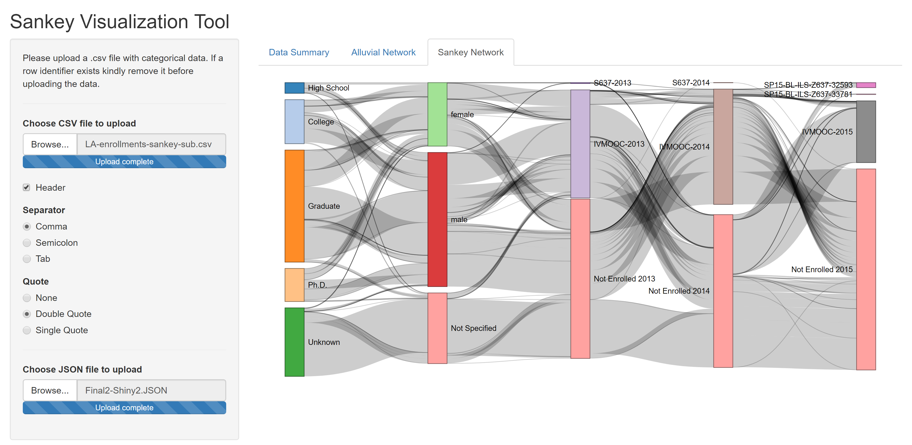

# Sankey Shiny Visualization Tool
  Sankey diagrams are a specific type of flow diagram, in which the width of the arrows is shown proportionally to the flow quantity.
  
  

## Steps for Alluvial plot
- Download the ui.R, server.R and LA-enrollments-sankey-sub.csv files
- Open ui.R and server.R in Rstudio
- Run the app
- Upload the LA-enrollments-sankey-sub.csv file 
- Have a look at the data in the data summary tab
- Oberve the visualization in the Alluvial network tab

## Steps for networkD3 Sankey plot
- Download the ui.R, server.R and LA-enrollments-sankey-sub.csv files
- Open ui.R and server.R in Rstudio
- Run the app
- Upload the Final2-Shiny2.JSON file 
- Oberve the visualization in the Sankey network tab

## Note
- The upload functionality will work on a restricted data format for this app.
- The code can be modified appropriately to suit the available data format
- Please upload a .csv file with categorical data. If a row identifier exists kindly remove it before uploading the data.

## References
- (https://christophergandrud.github.io/networkD3/)
- (https://cran.r-project.org/web/packages/networkD3/networkD3.pdf)
- (https://cran.r-project.org/web/packages/alluvial/alluvial.pdf)
- (https://www.r-bloggers.com/alluvial-diagrams/)
- (https://bost.ocks.org/mike/sankey/)
