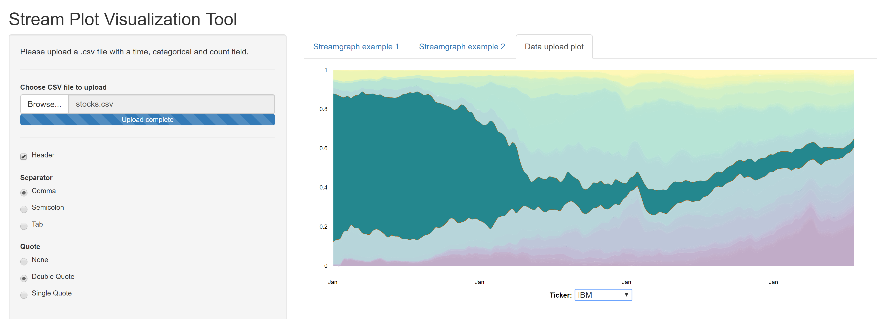

# Streamplot Shiny Visualization Tool
  A streamgraph (or "streamplot") is a type of stacked area graph which is displaced around a central axis, resulting in a flowing, organic shape. Streamgraphs were developed by Lee Byron and popularized by their use in a February 2008 New York Times article on movie box office revenues. [WikiPedia](https://en.wikipedia.org/wiki/Streamgraph)
  
  

# Steps
- Download the app.R and stocks.csv files
- Open app.R in Rstudio
- Run the app
- Have a look at the two examples provided in the app
- Upload the stocks.csv file 
- Oberve the visualization on the data upload tab

# Note
- The upload functionality will work on a restricted data format for this app.
- The code can be modified appropriately to suit the available data format

# References
- (https://hrbrmstr.github.io/streamgraph/)
- (https://github.com/hrbrmstr/streamgraph)
- (http://rpubs.com/hrbrmstr/59200)
