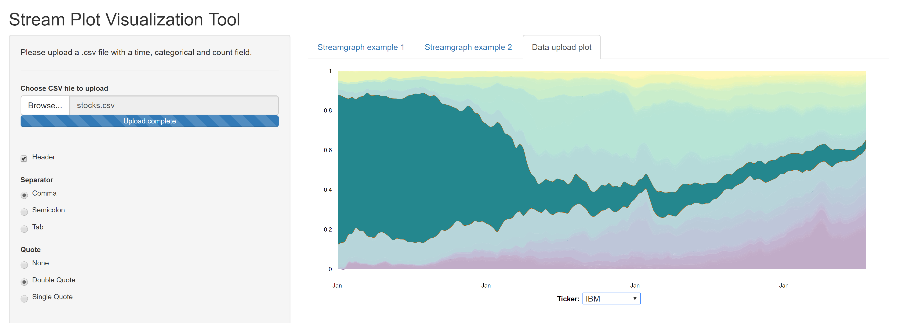

# Streamgraph Shiny Visualization Tool
  A streamgraph (or "stream graph") is a type of stacked area graph which is displaced around a central axis, resulting in a flowing, organic shape. Streamgraphs were developed by Lee Byron and popularized by their use in a February 2008 New York Times article on movie box office revenues. [WikiPedia](https://en.wikipedia.org/wiki/Streamgraph)
  
  

# References
- (https://hrbrmstr.github.io/streamgraph/)
- (https://github.com/hrbrmstr/streamgraph)
- (http://rpubs.com/hrbrmstr/59200)
